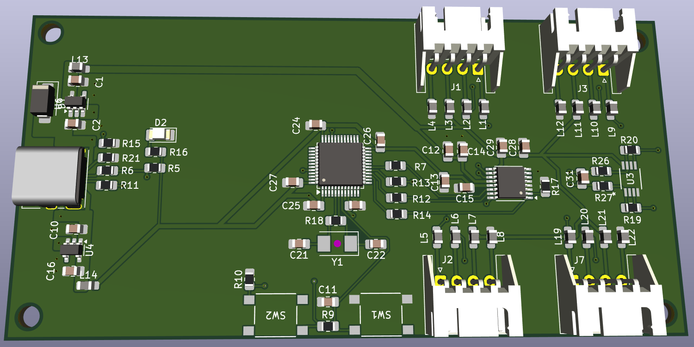

# ADS1220-Klipper-Board
A board for connecting up to 4 Load cells to an ADS1220

## Project Goals
This board is intended to be a reference design for eventual commercial boards that want to implement load cell probing.
We intend to tackle the following problems found with simple prototyping boards that connect via SPI I/O pins:

* Produce a clean 5V power supply on board for low noise load cell bridge measurements
* Reject common 3D printer electrical noise sources including: Voltage Regulators, Steppers, Heaters & 50Hz/60Hz line noise
* Gracefully handle Voltage Spikes & Ground Loops
* Provide Amplification/Gain to support low sensitivity (1mV/V) load cells to be able to measure 1g of force change
* Ability to connect up to 4 load cells in parallel to measure force on a printer's bed

Eventually we would like individuals to be able to order a board from a board house, once we nail down the component selection.

## Project Status: Prototyping
This is currently in the prototyping stage. Prototype goals are as follows:

1. Get it to work!
1. Prototype and test one 5V supply architecture (12V -> 5V via low noise switching regulator)
2. Test 5V to 3.3V via LDO
3. Test with and without 1 differential amplifier. 
4. Investigate voltage spikes and ground loops.

Future prototypes will refine the board:
1. Investigate additional 5V suppy architectures
2. Investigate additional amplifiers
2. Design for Supply Chain an Manufacturability: investigate component alternatives that are asier to get in the CN component supply chain.

## Specs
* ADC: [Texas Instruments ADS1220](https://www.ti.com/product/ADS1220)
* Additional differential amplifier: TK (prototype will try the [Microchip MCP6V92](https://www.microchip.com/en-us/product/mcp6v92) )
* * 4 x 4 pin JST HX connectors for full bridge load cells
* MCU: STMicro [STM32F103C8T](https://www.st.com/en/microcontrollers-microprocessors/stm32f103c8.html) MCU, Arm® Cortex® Cortex M4 @ 75Mhz
  * Klipper and Katapult support this chip well, including flashing over CAN if we decide to enable that later
* USB C for communicating with a klipper host
* Physical Boot and Reset buttons

## Why the ADS1220?
Several printers have shipped with the HX711 ADC chip which only supports 80 samples per second (SPS).
We consider this to be too slow for use as a Probe in the 3D printer as probing speed is limited to ~2mm/s.
There is a faster variant, the HX717, that supports 320 SPS. This shipped in all of Prusa's Nextuder products
and those support probing at up to 10mm/s. We consider this the minimum sample rate required for a 3D printer.

Both of these chips have the disadvantage of not being standard SPI devices and requiring a lot of MCU overhead to support communication.
Their data sheets are also lacking a lot of detail and the HX717 datasheet isnt available in English.

The ADS1220 is a good match for the capabilities of the HX717. Specifically:
* It supports faster sample rates close to 320SPS: 330, 350, 600, 660, 1000 & 1200. Higher sample rates improve the safety margin for
probing if the noise can be kept low and the sensitivity is high. Other ADC chips tend to have a large gap in the sample rate range from 
around 300SPS to 1000SPS.
* It has a PGA that supports up to a gain setting of 128
* Supports standard SPI
* TI provides a detailed datasheet and have reference designs
* Relatively cheap and widely available in the supply chain. Cost is a large
factor in getting a part into a commercial 3D printer board.

Features lacking on the ADS1220:
* The SPI speed is slow
* It lacks a "power reset" register. Reboots due to voltage spikes cant be detected at runtime.
The HX711 & HX717 also lack this feature. Higher end TI product do have this e.g. ADS1263. If we were
shipping a commercial product we would insist on this safety feature.

